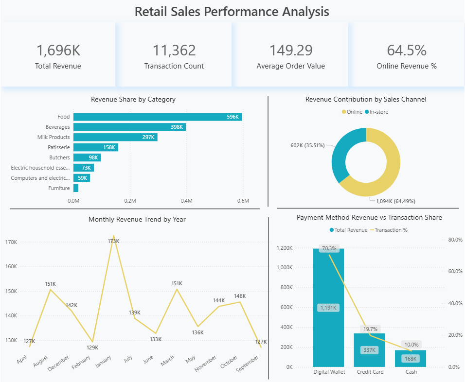

# Retail Sales Data Pipeline & Analytics


## Project Links
- **Power BI Dashboard:** [View Interactive Dashboard](https://app.powerbi.com/view?r=eyJrIjoiYjExZmJmODItYzZkZC00YWE3LTlkMWQtZTgxYjI5ZDM4NGRhIiwidCI6IjI1Y2UwMjYxLWJiZDYtNDljZC1hMWUyLTU0MjYwODg2ZDE1OSJ9)
- **EDA App:** [View EDA Notebook](https://retail-sales-data-pipeline-analytics.streamlit.app/)

## Summary
This project is an end-to-end retail sales analytics workflow built using MySQL, Python, Azure Blob Storage, Azure Data Factory, Azure SQL Database, and Power BI.

It starts with raw retail sales data in CSV format, cleans and transforms the data in Python, loads the cleaned dataset into Azure SQL Database, and uses the same cloud database for analysis in Python and dashboard reporting in Power BI.

The project focuses on sales performance across product categories, payment methods, discounts, customer purchase behavior, and online vs in-store sales.

## Business Problem
Retail businesses generate large volumes of transaction-level data, but raw data alone does not support decision-making.

This project was built to convert raw sales data into an analysis-ready dataset and answer business questions such as:
- Which product categories generate the highest revenue?
- Which payment methods contribute the most sales?
- Does discounting increase quantity sold?
- How do online and in-store sales compare?
- What are the monthly sales trends over time?
- Which products are the top revenue contributors?

## Tools & Technologies
- **MySQL** – raw data loading on localhost
- **Python** – data cleaning, transformation, and analysis
- **Pandas** – data processing and aggregation
- **Jupyter Notebook** – cleaning and EDA workflow
- **Azure Blob Storage** – cloud storage for cleaned data
- **Azure Data Factory** – data movement from Blob Storage to Azure SQL Database
- **Azure SQL Database** – final cloud database for analysis and reporting
- **Power BI** – dashboarding and visual reporting
- **Power BI Service** – dashboard publishing and reporting management

## End-to-End Workflow
1. Raw retail sales data was collected in CSV format.
2. The raw CSV data was loaded into MySQL on localhost.
3. Data was extracted into Python for cleaning and preprocessing.
4. The cleaned dataset was saved as a new CSV file.
5. The cleaned CSV was uploaded to Azure Blob Storage.
6. Azure Data Factory was used to move the cleaned data into Azure SQL Database.
7. Azure SQL Database was then used as the final source for:
   - Python/Jupyter-based analysis
   - Power BI dashboarding and reporting

This workflow demonstrates practical data movement across local, cloud, database, and reporting layers.

## Key Insights

- Online sales contributed about 64.49% of total revenue vs 35.51% from in-store sales
- Food was the top revenue category at around 600K, followed by Beverages at 400K and Milk Products at 300K
- Digital Wallet contributed 70.2% of payment revenue, ahead of Credit Card at 19.9% and Cash at 9.92%
- Average quantity sold was about 9.99 with discounts vs 4.97 without discounts
- Monthly revenue stayed relatively stable between about 38K and 55K, with peaks in March 2023 and December 2023
- Revenue was led by a balanced group of top items rather than one product dominating sales

## Business Recommendations
- Focus marketing and inventory on online channels where revenue contribution is higher
- Increase stock and promotions for high-performing categories like Food and related items
- Encourage digital payment adoption through incentives to improve transaction efficiency
- Use targeted discounts to increase volume while monitoring impact on margins
- Plan campaigns around peak sales periods identified in monthly trends

## Repository Structure
```text
retail-sales-data-pipeline-analytics/
│
├── app/
│   └── retail_sales_analysis.py
│
├── notebooks/
│   ├── retail_sales_analysis.ipynb
│   ├── retail_sales_clean_data.ipynb
│
├── data/
│   ├── data_dictionary.md
│   ├── messy_retail_store_sales.csv
│   └── retail_store_clean_data.csv
│
├── docs/
│   ├── project_summary.md
│   ├── architecture_flow.md
│   ├── insights_and_recommendations.md
│   ├── powerbi_service_features.md
│
├── powerbi/
│   └── (Power BI files or export)
│
├── screenshots/
│   └── (charts and dashboard images)
│
├── sql/
│   ├── messy_data_csv_to_mysql.sql
│
├── README.md
└── requirements.txt
```

## How to View the Project
- Read this README for project overview and workflow
- Open the notebooks to review cleaning and analysis steps
- View screenshots in the `screenshots` folder
- Open the Power BI export or PBIX file, if included
- Review the Python analysis script or app files in the repository

> Note: Database secrets, credentials, and secure connection files are not included in this repository.